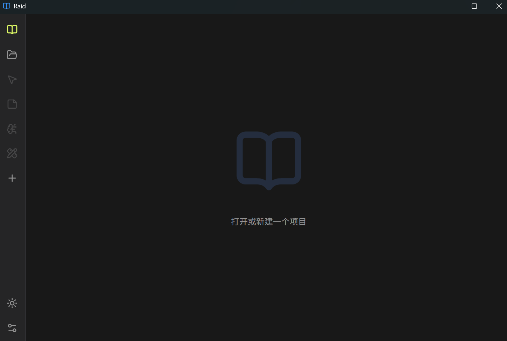
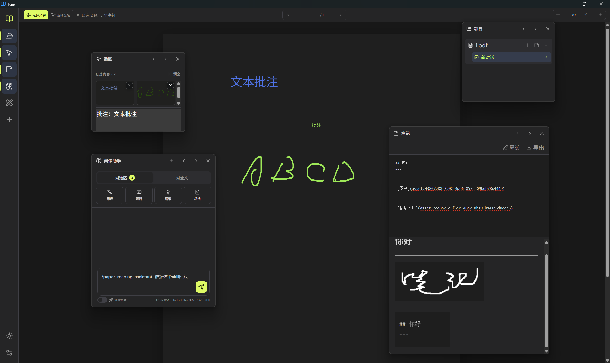
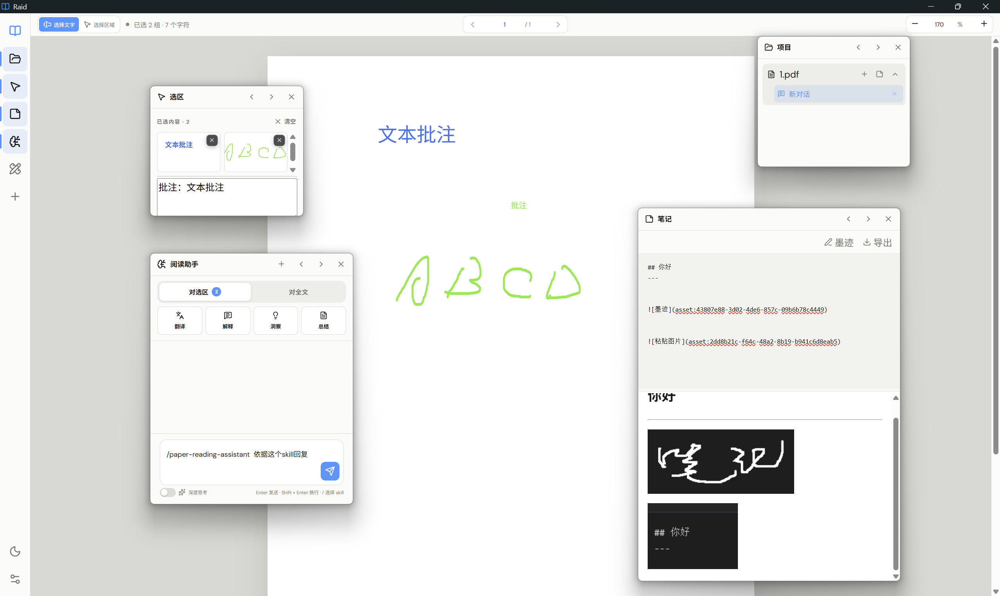

# Raid

[English](README.md) | [简体中文](README_zh-cn.md)

[](LICENSE)


Raid 是一款面向论文、教材和技术文档的轻量化项目式 AI 阅读器，集连续 PDF / 图片阅读、文字与跨页区域选择、OCR、Markdown 笔记、持久化批注以及用户自定义模型于一体。

> 作者：**xyLee** · [项目仓库](https://github.com/lxymol/Reading-Assistant)

## 主要功能

- 支持 PDF、图片、纯文本、Markdown、源码、常见办公文档和 EPUB，通过直接渲染或本地转换为 PDF 阅读
- 将文件拖到主窗口任意位置即可创建项目
- 文字或视觉区域选择
- 彩色文本与墨迹批注
- 实时 Markdown 笔记，支持粘贴图片、智能裁边墨迹和 Markdown 导出
- 不同组件侧边栏停靠，浮动窗口转换
- 对选区或全文进行AI问答，回复包含可跳转标签，多种模型可自行配置
- 支持导入 Skill 和语言包、自动 Skill 路由，以及显式 `/skill-command` 选择
- 支持多项目历史记忆与用户画像管理
- 支持系统分屏的窄窗口布局与缓存清理

## 界面展示







## AI 上下文策略

Raid 使用检索增强上下文，但不依赖向量数据库：

- **选区模式：**提供全文逐页缩略概览、选区页及相邻页的精确内容，以及从全文其他位置按词法相关性检索的片段。启用视觉模型时最多发送 4 张选区图片。
- **全文模式：**提供全文结构概览；在上下文容量允许时发送全文精确文字。超大文档则同时采用问题相关片段与跨全文均匀分布的代表性片段。
- **来源定位：**回答中的页码标记会依据实际抽取页面进行校验，并显示为简洁的可点击页码引用。
- **批注参与：**可见墨迹会绘制进选区图片；与选区重叠的文本批注会加入识别文字，全部文本批注也可参与全文问答。

这种方式兼顾选区附近的精确性、全文问题的覆盖面，以及大型文件下的上下文可控性。

## 记忆方法

Raid 包含两种不同的本地记忆：

- **项目记忆：**使用 IndexedDB 保存源文件 Blob、对话、当前页、缩放、阅读模式、笔记及其图片、文字高亮和批注。在“设置 → 记忆设置 → 项目记忆”中删除项目，会永久删除完整记录及相关资源。
- **用户记忆：**可选、可编辑的稳定背景和回答偏好画像。开启后，默认模型可根据当前问题与回答更新画像；文档原文不会作为用户画像的学习材料。

项目记忆属于文档状态持久化，并不是语义 RAG 记忆。AI 所使用的检索增强上下文，会在发起请求时从本地抽取的文档文字中生成。

## 安装

Windows 用户可从 [GitHub Releases](https://github.com/lxymol/Reading-Assistant/releases) 下载安装程序。Raid 不修改系统环境变量，也不要求另行安装 Node.js。

Raid 将项目、对话、笔记、批注、设置和缓存统一保存在程序旁边的 `RaidData` 文件夹。更新、重装或卸载前，如需保留资料，请进入“设置 → 记忆设置 → 打开 RaidData”，完全退出 Raid 后把整个文件夹移到安全位置；恢复时在启动新版前把它放回 `Raid.exe` 旁边。

当前版本：`1.0.0`。

## AI 配置

打开“设置 → 模型设置”，填写 API 接口地址、模型名称和 API Key。Raid 不预设服务商。

| 配置 | 用途 |
| --- | --- |
| 默认模型 | 文字处理、全文问答、翻译、Skill 路由和可选用户记忆更新 |
| 视觉模型 | 选区图片、公式、图表、示意图和扫描内容 |
| 深度思考模型 | 开启深度思考后的纯文字推理任务 |

高级配置留空时会沿用默认接口和 Key。点击模型输入框右侧的问号按钮可获取可用模型。兼容接口应提供：

- `GET /models`
- `POST /chat/completions`

## Skill 与语言包

- 在“设置 → 技能设置”中导入根目录包含 `SKILL.md` 的文件夹，Raid 会读取其说明和支持的文本参考文件。
- AI 可根据 Skill 元数据自动路由，也可在消息开头输入 `/skill-command` 强制指定。
- 在“设置 → 语言设置”中导入包含 `language.json` 的文件夹；所选语言同时控制界面、AI 回答和翻译目标语言。

## 从源码运行

需要 Node.js 20 或更高版本。

```bash
npm install
npm run dev
```

启动隔离的桌面测试版：

```bash
npm run desktop:test
```

## 构建

```bash
npm run lint
npm run build
npm run desktop:pack
```

## 隐私与安全

- PDF 渲染、文字抽取、OCR、笔记、批注和项目存储都在本机完成。
- 只有发起 AI 操作后，用户配置的 AI 服务才会收到选中材料、生成的文档上下文、近期对话、可选用户记忆，以及最多 4 张视觉选区。
- 为恢复项目，源文件及相关资源会保存在本机 IndexedDB；除非作为 AI 请求内容，否则不会上传。
- API 配置保存在应用本机数据目录，不会进入仓库或安装包，但并非操作系统密钥库加密。

安全问题请参阅 [SECURITY.md](SECURITY.md)。

## 贡献

欢迎提交 Issue 和 Pull Request。开始开发前请阅读 [CONTRIBUTING.md](CONTRIBUTING.md)。

## License

Raid 使用 [MIT License](LICENSE)。
